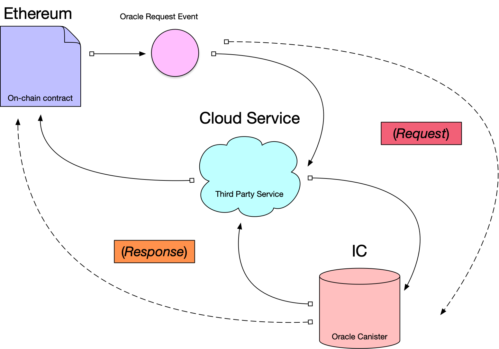

# Establishing an Independent Oracle market on the IC

# SmartPiggies Overview:

Smartpiggies is a Defi NFT project. Each SmartPiggy NFT is a digital object that contains stablecoin collateral and options contract execution logic .

A SmartPiggy is effectively a price insurance contract. Like any typical insurance contract, it protects the holder for a period of time, up to a maximum benefit, and is sold by the writer. Once the price of an underlying asset crosses a threshold, the holder of the SmartPiggy may initiate the clearing process and claim benefits.

# Motivation:

It is critical that SmartPiggies Inc. must not be categorized as a “virtual asset service provider” or VASP as defined by the “Financial Action Task Force” or FATF.
Part IV of the FATF definition of a VASP covers: ... Safekeeping and/or administration of virtual assets or instruments enabling control over virtual assets.
https://www.fatf-gafi.org/publications/fatfrecommendations/documents/guidance-rba-virtual-assets-2021.html

Given that the outcome of SmartPiggy contracts are driven by reported underlying prices, it is important that the reporting of underlying prices is not controlled by SmartPiggies Inc. 

In order to resolve this, SmartPiggies Inc. needs to establish an independent Oracle market.

* Ideal properties of an Independent Oracle market:
* Users of any level of sophistication can report prices
* Users providing prices profit from this service  
* Consumers can identify which Oracles are trustworthy (direct relationship/federated certification/reputation/TokenCuratedRegistry/etc.)
* SmartPiggies Inc. has no control over any aspect of the Oracle Market

The IC allows for the frictionless creation and maintenance of user owned Oracle Canisters. Individual users can provide local knowledge and observations to other users for a profit. With user owned IC Canisters, all intermediary services and infrastructure is eliminated and the data ‘Chain-of-trust’ becomes a direct producer/consumer relationship. 

#Advantages of IC Oracles over other implementations:
* IC Infrastructure is decentralized and controlled by users - Other Oracle services require centralized infrastructure to serve applications and data 
* The IC allows for the storage and retrieval of historical records for many underlyings - Recording historical prices on layer 1 blockchains for many underlyings would be cost prohibitive regardless of implementation.

# Required Specifications:

Data storage spec - Data structure - data storage frequency - format - data type
Permissioning spec - read - write - modify - delete - add admin
Audit log spec - store auditable events (modify/delete)
Tokenomics spec - Oracles need to be compensated for service - IC cycles need to be provided - Oracles need to be validated/curated - Token curated Registry - Reward voters - Account for arbitration events. 
User interface spec - title - description - hyperlinks - social media - logo - backsplash -  data entry UI - chart display - data maintenance UI - audit log UI - permisioning UI - Tokenomics UI - Need UI permissioning logic restricted by principal IDs
Ethereum interface spec - Long term native integration (respond to on-chain events) - Short term requires a third party service hosted on AWS.
Data IN spec - define API
Data OUT spec - intra-canister communication - Front end application communication model needs to be revamped
Oracle Factory spec

# User Controlled Price Oracle
Internet Computer repo for a user controlled price oracle

* clone repo
* cd into repo
* run `npm install`
* run `dfx start` (in another terminal or background)
* run `dfx deploy`
* test with `dfx canister call price_oracle greet "[name]"`

view the Candid UI with:

http://localhost:8000/?canisterId=<candid-id>&id=<canister-id>

for example:

http://127.0.0.1:8000/?canisterId=r7inp-6aaaa-aaaaa-aaabq-cai&id=rrkah-fqaaa-aaaaa-aaaaq-cai

id found in `.dfx/local/canister_ids.json` or with:

`dfx canister id __Candid_UI`

and

`dfx canister id <caniser name, i.e. price_oracle>`

upgrading the canister:

`dfx deploy`

or

`dfx canister install --mode=upgrade --all`

Records can be queried from the Candid UI

However, records can only be added with an authenticated user:

`dfx canister --wallet=$(dfx identity get-wallet) call price_oracle addRecord '("20220123", 2057)'`

## Adding records with an admin (locally):

Steps for creating a new identity and adding it as an admin:

`dfx identity new ic_admin`

`dfx use identity ic_admin`

`dfx identity get-principal`

`dfx use identity default`

`dfx canister —wallet=$(dfx identity get-wallet) call price_oracle setAdmin ‘(principal “<principal from ic_admin>”)’`

`dfx —identity ic_admin canister call price_oracle checkAdmin`

`dfx —identity ic_admin canister call price_oracle addRecord ‘(“20220124”,2062)’`

`dfx identity list`

`dfx identity remove ic_admin`

## Deployment

`dfx canister --network=ic create --all`

`dfx canister build --check --network=ic`

`dfx canister --network=ic install --all`

deployed to canister id: `lkvnh-zyaaa-aaaai-qfl2q-cai`

`dfx canister --network=ic --wallet=$(dfx identity --network=ic get-wallet) call price_oracle addRecord '("20221023",2057)'`

## Costs

Failed added record: 10 938 cycles

Successful added record: 3 102 327 cycles

Read record: 54 690 cycles
